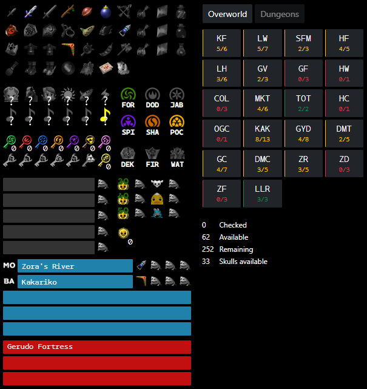

# Completing the Seed

When starting out, I recommend just playing however you feel like and exploring the world at your own pace. If you want a little more guidance than that, though, this article will have some tips on how to beat the seed.

If at any point you're unsure how to progress, or your tracker says you're able to do something but you're not sure how, I'd recommend reading the [Glitchless Logic](https://wiki.ootrandomizer.com/index.php?title=Logic) wiki page. This breaks the game down into different regions and common pitfalls in each one. If you still can't find what you're looking for on this page, you can ask in the `#gameplay-and-tricks` channel in the discord.

Your final goal in this seed is to defeat Ganon. We can break this down into some smaller steps:

- Figure out which dungeons are required.
- Find the items needed to complete those dungeons.
- Defeat Ganon.

## Early game

Whenever is convenient, I recommend going to your item screen in the pause menu and holding A or D-pad Down. This shows you which dungeons hold which dungeon reward, which you obtain upon stepping through the blue warp after defeating the dungeon boss.

In order to open the bridge to Ganon's Castle, you need the six medallions. Collecting the three stones gets you the Ocarina of Time song check, but this check is junked in these settings, so that is never required. Keep in mind, however, that it's still possible for a stone dungeon's boss heart container to be a required item, so you may still end up needing to complete some of these stone dungeons.

I recommend taking notes on what the dungeon reward layout is and referencing it as you play the seed so you can always keep in mind which dungeons are actually required. Many trackers like HashFrog or Gossip Stone Tracker have spots to do this. If you don't take a note of it, though, you can always just reference it in the pause menu.

## Hints

You'll find gossip stones scattered throughout the world, and talking to one will give you a hint. These may be what a particular check may have, or what locations might contain important items. It's useful to take note of these as well whenever you find new hints.

If a hint says a region is **Path to Boss**, it means that an item in that region is required to beat that boss. If you are still missing items to defeat that boss, it's a good idea to clear out more of those path regions if you can.

If a hint says a region is **Foolish**, it means there are no items in that region that are required to beat the seed, and thus all the checks there are skippable. You can, of course, still go to and clear out these regions if you want to practice learning the checks there.

> **Note:** Just because a region is foolish doesn't mean you never need to go there; it just means every randomized check in that region is unrequired. For example, Zora's River might be hinted foolish, but the bean salesman is not randomized and always sells you beans. This means you might still be expected to buy beans in order to beat the seed.

## Tracker

As you're playing, I recommend using a tracker to track your items and hints, and also see what is available for you to do in the seed. The following screenshot is from [Hashfrog](./setting-up.md#hashfrog), but the concepts apply to most other trackers as well.

In the dungeon reward section, you can scroll/click on the text to indicate what dungeons contain what rewards.

At the top left you can click items as you find them. The right side will show the different regions in the game, and if you click into any one, you can see checks that are available for you to do based on your current items. Hovering over any check will also let you see what items are required to do the checks.

You can use the blue text boxes to enter path hints. Type in the location, and then use the box on the left to select which boss the location is path to. You can then drag items to the frog icons to indicate what items you found in those locations.

The red text boxes can be used to enter foolish locations, but you can also just click on the corresponding region and toggle all the checks to remind you that you don't need to do any of them.

The gray text boxes can be used to enter other hints you find, and what item is hinted in those locations. If it's junk, you can just go into the check tracker and click it as if you already did the check, but if it's important, noting it in the text box can be useful.

## Mid-Late Game

I recommend making your way to locations that are dense with available checks to maximize your chance of finding items that you need. Check trackers can be useful for this to see at a glance where the densest locations are. Hashfrog shows the number of checks available out of total number of checks, and highlights it green when you can do everything in the region, so these are typically good options.

If you ever find that you can fully complete a required dungeon, getting those out of the way are a good idea too since you'll have to do it at some point to beat the seed.

> Note: If you are using a check tracker like Hashfrog, a dungeon might not show up as fully completable, when in fact have everything you need. This is likely because you haven't gone into the dungeon and collected the keys yet. If you're unsure what you're missing for a dungeon, it can be useful to hover over the boss heart container and see what you're missing. If it's only keys, you likely have everything you need!

## End Game

When you've found all six medallions, you can make your way to Ganon. To actually defeat Ganon, you'll need to be able to use light arrows, which requires having found the light arrows as well as a bow and magic.

If you have everything but light arrows, you can go straight to the Ganondorf fight, and he will tell you what region you can find them in to help narrow down where you need to look. Be sure to save, and then reset the game to continue getting lights.

## Tips and Tricks

The following are by no means necessary to complete a seed, but can make things a lot more convenient, especially when seeds take multiple hours to complete.

This video covers the basics:

<iframe width="560" height="315" src="https://www.youtube.com/embed/goB7jW1Ur98?si=xJnx_agEhDd0x1C6" title="YouTube video player" frameborder="0" allow="accelerometer; autoplay; clipboard-write; encrypted-media; gyroscope; picture-in-picture; web-share" referrerpolicy="strict-origin-when-cross-origin" allowfullscreen></iframe>

### Movement

Rolling is faster than running. You want to press A when you see Link stands up from his previous roll. Here's a video of [optimal rolls](https://www.youtube.com/watch?v=jqmqkcIwXsg).

The fastest way to get around is actually backwalking by holding Z and down on the analog stick (1.5x faster than running!). The obvious downside is you can't see where you're going, so it's best for long, empty stretches. When you're starting, just roll everywhere, but if you're somewhere like Hyrule Field and your goal is just to get from one side to the other, try aiming in the general direction and backwalking.

### General Combat

Different weapons have different damage values. Kokiri Sword, Master Sword, and Biggoron Sword (BGS) do 1, 2, and 4 damage respectively. Deku sticks behave the same as a Master Sword that breaks, and is the strongest weapon as child.

You can do a jumpslash by having your sword out, targetting, and hitting A. This does 2x damage for all weapons.

You can also crouch stab by holding shield and hitting B (you cannot be targetting when doing this). Crouch stabs are interesting in that they don't have a fixed damage value; they use the damage of the last melee attack you did. So if you jumpslash with a Deku stick, you've "stored" 4 damage. Now if you crouch stab with a Kokiri Sword, each stab is doing 4 damage. Crouch stabs also happen to be the fastest way to attack, so this is often your best combat option. Just remember to store as much damage as you can before the fight!

Another funny quirk about crouch stabs is that they retain the property of the last attack you did as well. So if you swing a Megaton Hammer, all your crouch stabs, even if it's with a sword, will be able to break boulders.

### Child Combat

Since you don't start with a Kokiri Sword, you'll rely a lot on Deku Sticks to fight as child. If you find yourself running out, you can save and quit in the overworld to spawn back in Kokiri Forest, where you can purchase more sticks.

A trick to help conserve sticks is **Broken Stick**. This lets Link continue holding a stick even after it breaks, and you can continue to swing it until you put it away. The universal way to get a broken stick is as follows:

- Walk into a wall and target it. This will snap Link to look straight at the wall.
- Backflip
- Either (a) tap your shield or (b) let go of target and then hold target again.
- Pull out a stick
- Press A to jumpslash

<iframe width="560" height="315" src="https://www.youtube.com/embed/avFYl6eZdrE?si=x_7uwP1hPHRVbU_R" title="YouTube video player" frameborder="0" allow="accelerometer; autoplay; clipboard-write; encrypted-media; gyroscope; picture-in-picture; web-share" referrerpolicy="strict-origin-when-cross-origin" allowfullscreen></iframe>

When done correctly, you should hear the stick hit the wall twice, and Link will continue to hold the stick after the jumpslash. You can then continue to swing the stick as many times as you want.