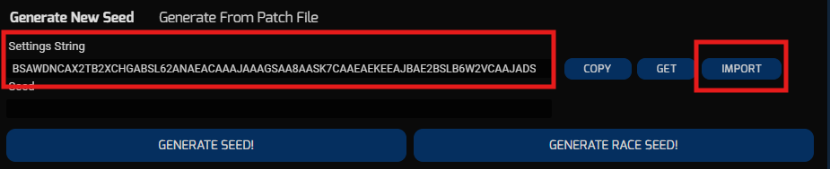
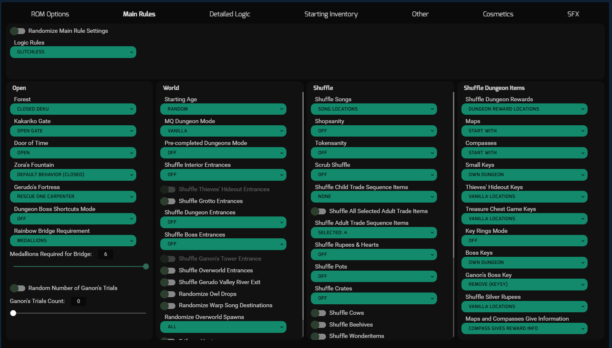

# Setting Up Your First Seed

There are a lot of resources for how to actually generate a seed to play. For a video tutorial you can follow [Trez's guide](https://www.youtube.com/watch?v=7X0Le98C5Yc), and for a written tutorial you can follow the [Setup](https://wiki.ootrandomizer.com/index.php?title=Setup) page on the OoTR Wiki.

The rest of this article is primarily about the settings that I recommend for your first seed. There are so many things you can randomize in OoTR, and a lot of these can be overwhelming. I'll show you a quick way to get started without worrying about the details.

> **Note:** The following instructions are for the [v9.1.0 generator](https://ootrandomizer.com/generator?version=9.1.0). Make sure you're on the same version. If the current version is wildly out of date, check the [About](../about.md) page for how to reach out to me and let me know to update these instructions.

## Loading the Settings

The seed we will generate will be using the settings from the Mentor Tournament 2026. This tournament was designed for new players who want to learn the game with the help of mentors, and was designed to be relatively straightforward. However, these are also meant to be played with a mentor to help coach you along the way, so if it's your first time and you are playing this solo, there are some tweaks I will recommend at the end to make it more manageable.

Head to the [v9.1.0 generator](https://ootrandomizer.com/generator?version=9.1.0), and scroll to the bottom where you see a box to enter a Settings String. In this box, paste the following:

`BSAWDNCAX2TB2XCHGABSL62ANAEACAAAJAAAGSAA8AASK7CAAEAEKEEAJBAE2BSLB6W2VCAAJADSB4SHAE2BRCEH7KYCADJBLUK7NBAASAAUMAN2HCJRYS2GSDAABDEGHA8A6BEAWJSNEDE`

After pasting, **make sure you click Import**. This takes the settings string and updates all the relevant settings in the generator. If you want to quickly verify it worked, you can click on the Main Rules Tab and see if it looks something like this:

From here, you're good to go! If you want to start playing with these settings out of the box, you can skip to [Generate the Seed](#generate-the-seed). However, if you've never played randomizer before, there are a couple tweaks I recommend. You can pick and choose from these to customize the experience to your liking. Ones that I highly recommend are tagged.

## Main Rules Tab
- In the World column, set Starting Age to Child, which matches the vanilla game.
- In the World column, click Randomize Overworld Spawns and uncheck both Child and Adult. This makes it so child will spawn in Kokiri Forest, and adult will spawn in Temple of Time, which matches the vanilla game.
- **(Recommended)** In the Shuffle column, under "Shuffle Adult Trade Sequence Items", uncheck everything except Claim Check. This makes it so you don't have to do the adult trade sequence to get the item from Biggoron. Instead, you will only find the claim check and you can turn that in directly.

## Detailed Logic Tab
- Aiming in first person can feel awkward at first, so if you don't want to get caught up on minigames that require aiming, you can disable these.
    - In Exclude Location, look for GF HBA 1000 Points, GF HBA 1500 Points, Market Shooting Gallery Reward, and/or Kak Shooting Gallery Reward.
    - Click on the ones you want to exclude to highlight them, and then click Add to move them into the right column. These are checks that will be disabled. You can still do them if you want, but they will be guaranteed to not contain anything useful.
- **(Recommended)** In Enable Tricks, there are a lot of tricks enabled (in the right column). Select all of them **except** Hidden Grottos without Stone of Agony, and click Remove to move them into the left column. The only thing on the right should be the Hidden Grottos trick. We keep this one trick enabled so that if you are using a check tracker, it can tell you when grottos are available even when you don't have Stone of Agony.

## Starting Inventory Tab
- Under Starting Equipment, click Hylian Shield and click Add to move it into the right column. This just makes it so you don't have to worry about getting money to buy a shield early on.

## Other Tab
- Under Hints and Information, for Minor Items in Big/Gold chests, check bombchus. This makes it so that you can find bombchus in big chests, and makes it so that small brown chests will never have anything particularly useful. If you want, you can also check shields and stick/nut capacity if you want to completely avoid small brown chests, but this is typically never done.

## Cosmetics
- Pick your preferred Default Targeting Option. If you're unsure, stick with Hold.
- I like to uncheck Item Model Colors Match Cosmetics so that it’s easier to identify items that I spot in the overworld, but this is up to you.
- You can turn on input viewer, which shows your controller inputs at the bottom of the screen. This also includes your analog stick values, so this can be useful for tweaking [controller sensitivity](./setting-up.md#controller-sensitivity) during your game.

Feel free to modify the remaining cosmetics how you wish.

## Generate the Seed
Clicking `Generate Seed` at the bottom will bring you to a new page where you can patch the seed. You can also share this link so that others can view or play the same seed.

On this page, you can still make final tweaks to cosmetics or SFX if you'd like.

In `ROM Generation`, make sure you select the correct output type based on your platform, and then supply the necessary base ROM and/or WAD file.

## Settings Overview
Listed below are some highlights of these settings, as well as things in the randomizer that you might not expect if you're only familiar with the vanilla game.

- Collecting 6 medallions will open the rainbow bridge to Ganon's castle. **This is your win condition.** Ganon's trials are off, so once you enter the castle, you can head straight to Ganondorf.

- On the item screen in the pause menu, if you hold A or D-pad Down, you can see your dungeon layout. This tells you which dungeons hold which dungeon rewards, which you will receive upon stepping through the blue warp after defeating the dungeon boss.

> **Note**: Not all settings have this feature from the start. Some settings require you to read the pedastal in Temple of Time in order to get this information, and only then will it be available in your pause screen.

- Chests are textured to indicate their contents. Only big chests will contain major items that can affect the progression of the game. You can also find small pink chests, which contain heart pieces or heart containers. In dungeons, small silver chests contain keys, and big gold/blue chests contain the boss key. You can get away with never opening small brown chests, but you can still do so when learning the game; it can help you learn the locations of all the checks in the game, and they might still contain things that are handy.

- Closed Deku - Getting into Deku requires talking to Mido at the entrance while you have a Kokiri Sword and Deku shield equipped, just like in the vanilla game. The rest of Kokiri Forest is open though, so you can leave without having completed the Deku Tree.

- The Door of Time is open, so you can freely change age at the Temple of Time. You also start with Prelude of Light, so you have easy access to age changes at any time.

- In Gerudo's Fortress, you only need to save one carpenter instead of all four. You will get the Gerudo Card after that.

- Songs are shuffled, but only amongst themselves. For example, speaking to Malon in Lon Lon Ranch will normally get you Epona's Song, but in the randomizer, you will learn a random song. This also means if you're looking for a particular song, it can only be in so many locations.

- You will start with a free random song. This is because you don't need to do the check where you go to Zelda and then learn Zelda's Lullaby from Impa; this song is given to you at the start. In the Mentor 2026 settings, you are also given Prelude of Light, and the song for getting the Ocarina of Time is junked.

- Scarecrow song is set to Fast. You need to set up scarecrow song by playing a song to Bonooru twice, once as child and again as adult. Once you do so, pulling out your ocarina in any spot where you can summon Pierre will automatically summon him without playing a song. Some settings will have Free scarecrow, which means this fast behavior is enabled from the start without having to talk to Bonooru as either age.

- When collecting Anju's cuccos, you only need to put three cuccos in the pen instead of all seven.

- When collecting big poes, you only need to show one to the poe buyer instead of all 10.

- To be more beginner friendly, the following checks are junked, meaning that rewards for doing these will not get you anything that you need to complete the seed.
    - Collecting 40 and 50 gold skulltula tokens.
    - Wearing the Mask of Truth in the Deku Theater. Note that wearing the Skull Mask is still enabled and may have something.
    - Song from Ocarina of Time. This normally requires getting all three spiritual stones, and can lead to some long All Dungeons (AD) seeds when that song is required.

- Talking to the skulltulas in the skulltula house in Kakariko will tell you what the rewards are for collecting certain number of skulltulas. There are no hints for the reward for collecting 10 skulls, but there is a hint for collecting 20 and 30 skulls.

> When entering the skulltula house, the 10 skull reward is on your right, 20 on your left, 30 in the back. 40 and 50 are junked, but they can be found in the back left and back right, respectively.

- Ice arrows are not in the game, and are instead replaced by Blue Fire Arrows. This has the same properties as the blue fire you store in bottles and can be used to melt red ice.

- If you reach the end of the game without light arrows, you can enter the Ganondorf boss room and he will tell you where you can find them. You can save and reset the game afterwards so that you can continue playing and find the light arrows.