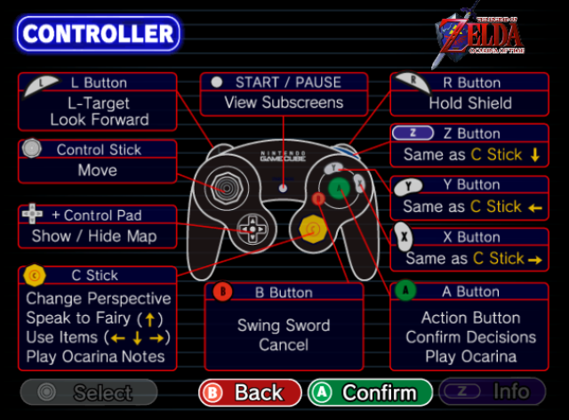
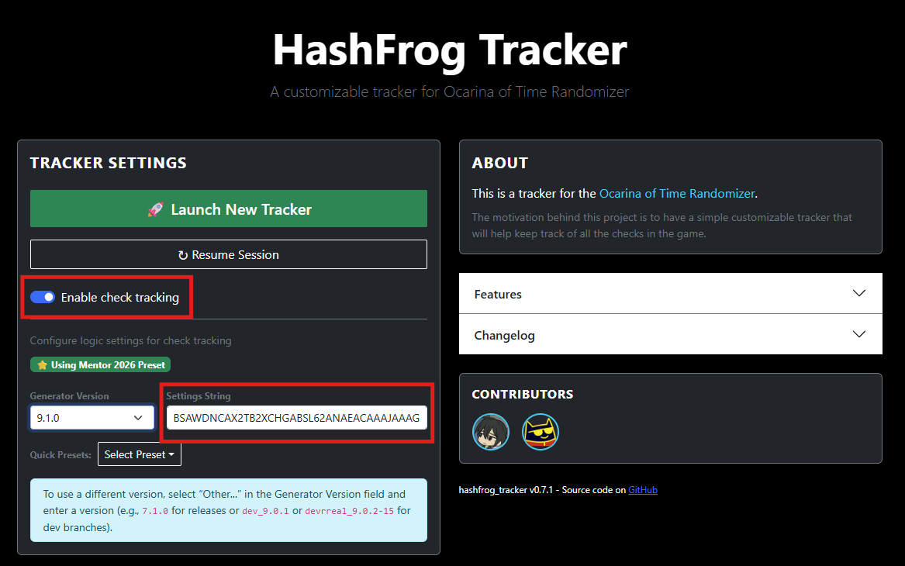

# Setting Up

If you haven't already, I recommend joining the [OoTR Discord](https://discord.com/invite/ootrandomizer). The `#resources` channel has all the links you need to get started, and you can ask questions in the channels under `Support & Discussion` if you need help with anything, whether it's about setup or about how to complete a seed.

The [OoTR Wiki](https://wiki.ootrandomizer.com/index.php?title=Main_Page) also has a lot of good info. The following sections will point to the parts of the wiki that are most helpful for getting started, but if you want, it's also a good idea to browse any other pages on the wiki that you find relevant or interesting.

## Platform

For how to actually play, most players are split between using emulators, the most popular being Project64 or Retroarch, or Wii Virtual Console. If you don't have a Wii, reference [the emulator section](https://wiki.ootrandomizer.com/index.php?title=Setup#Emulators) in the wiki. If you do have a Wii and want to play on VC, reference [the Wii VC](https://wiki.ootrandomizer.com/index.php?title=Wii_Virtual_Console) article to get set up.

## Controller

The controller you use is up to preference. You see all kinds of controllers at the top level, from GameCube controllers to XBox/Playstation controllers to keyboards. See [Controller Setup](https://wiki.ootrandomizer.com/index.php?title=Controller_Setup) for more information on setting up specific controllers.

For controller mappings, here's the mapping that you use if you're on VC.

On emulator, you can either copy this mapping or tweak it to your liking. The advantage to copying this mapping is that if you ever decide to switch to VC in the future, it will make the transition much easier.

### Controller Sensitivity

Out of the box, controller sensitivity can often be really bad, so it's worth looking into it early to make your life a lot easier.

I *highly* recommend getting the [Practice ROM](../intermediate/execution.md#practice-rom). You don't need to learn how to use it right now, but when you load it up, you'll notice at the bottom left you can see your analog stick values. Alternatively, when you generate seeds, you can turn on [input viewer](./first-seed.md#cosmetics) to see the stick values during your game.

If your emulator supports deadzones, I recommend setting the deadzone to 0. This is because OoT already has a deadzone built into the game, and artificially adding another deadzone makes small movements much harder. Any value from -7 to 7 is the same as 0.

If your emulator supports adjusting stick sensitivity, look at what the value is when you push the stick all the way. You want this to be around 75-80. OoT recognizes any value over 67 as the max value. A lot of emulator defaults can go as high as 127, which effectively makes half of the stick range the max value. This makes things like aiming in first person much harder than they should be.

If you're on Wii VC, the default sensitivity is very bad, and you unfortunately need external hardware to fix this. The common solution is to use an ESS Adapter to fix the controller mapping.

## Tracker

Most runners use trackers to help keep stay organized when playing a seed. Item trackers help keep track of what you've found and make it easy to see at a glance what you're still looking for and what dungeons you still need to complete. Map/check trackers help show you which regions still have checks available for you to complete to find your remaining items. See more in the [Trackers](https://wiki.ootrandomizer.com/index.php?title=Trackers) section in the wiki.

### Hashfrog

My recommendation for beginners is the [Hashfrog Tracker](https://hashfrog-tracker.com/). If you enable check tracking, it's both an item tracker and check tracker in one, and as you fill in the items that you've found, it will update with what locations in the game are available for you to complete. It also supports resuming sessions, so if you need to stop playing and resume later, it will remember the state of your tracker when you come back.

To set up check tracking, click on `Enable check tracking` and set the corresponding Generator Version and Settings String, which you can find on the seed page after you generate the seed. If you are using a preset from the generator, Hashfrog may also already have the same preset available in the dropdown.

>Note: If you are following this tutorial for your first seed, you can use the Mentor 2026 preset. You also want to look at Layout Configuration and use the HashFrog Mentor preset.

### Alternatives

Probably the most popular alternative is the [Gossip Stone Tracker HD](https://github.com/HapaxL/GSTHD#readme), which is similar to Hashfrog but without the check tracking. Another option at the top level is [Soli's tracker](https://soilflux.github.io/tracker/), and while it's probably the most powerful tracker available, there is a steep learning curve for using it and is not friendly for beginners.